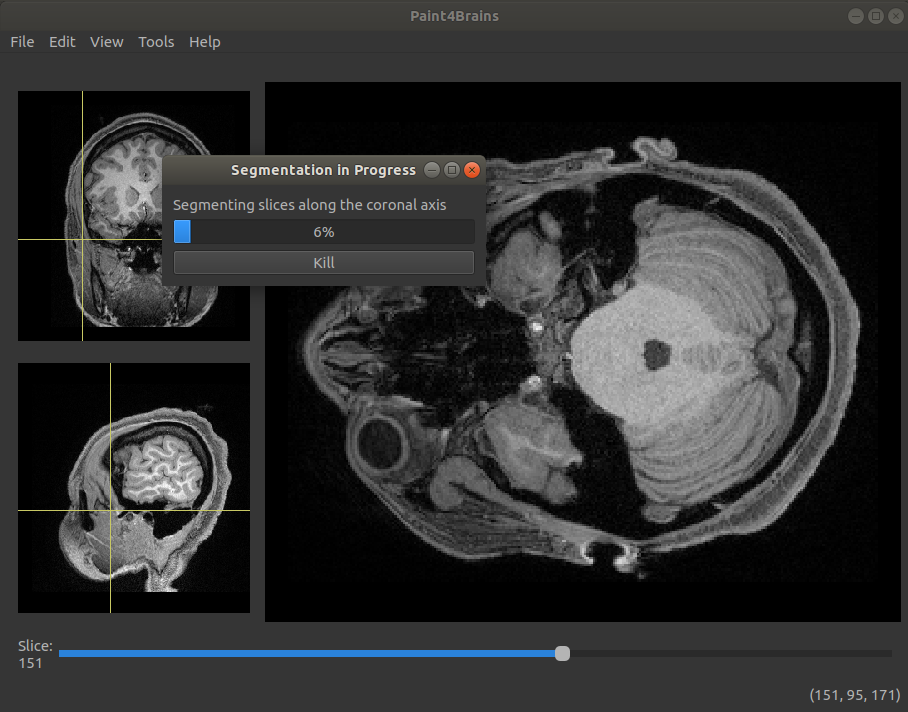
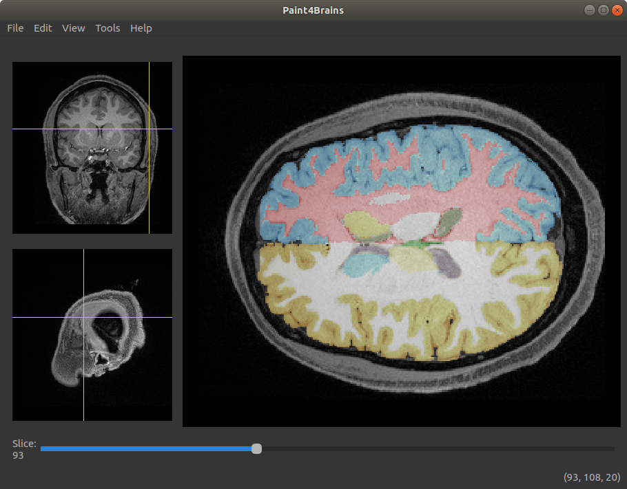
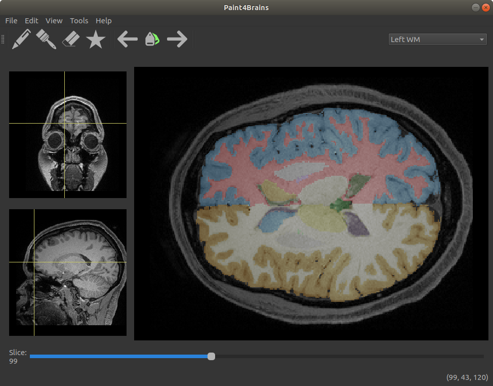

Basic Usage
===========

Getting started
---------------

When you open the Paint4Brains application, a window asking you to "Load brain MRI" will appear. Here you can select the NIfTI file you wish to open in a directory of your system.

Loading an MRI image at the start is required as Paint4Brains will not start without it.

.. image:: _static/screenshots/Load_screen.png
  :width: 500
  :alt: Loading Screen Example
  :align: center

Once a NIfTI file has been selected Paint4Brains will finally open.

.. image:: _static/screenshots/Plain_window.png
  :width: 500
  :alt: Paint4Brains Start Screen
  :align: center

On the center of the screen, an image showing the axial slice of the uploaded volume is shown. With both the coronal and sagittal view shown on two side panels on the left.

As you move your mouse around the central image, a yellow cross indicates your position on both of the other view. The view shown in the central image can be changed by double clicking on either of the side images. The 3-D position of your mouse is displayed on the bottom right corner

To explore different slices of the central image, the slider below it can be used. Scrolling the mouse wheel can achieve the same behaviour.

You can zoom in and out any of the images by placing the mouse over the area you wish to enlarge and then scrolling the mouse wheel while pressing the CTRL key. If you are not in Drawing mode this can also be achieved by moving the mouse up or down while holding the right button.

Segmentation
------------

By going to the "Tools" menu bar and clicking on "Segment Brain" the uploaded volume will be segmented. This can also be done by using the CTRL+W shortcut. Once this is clicked you will be asked if you want to run it on a GPU or a CPU. If your computer does not have CUDA installed you should click CPU. However, running it on a GPU will lead to it running a lot faster (around 50 times faster).

Once segmentation has started the following window will appear:

This shows an estimate of how far into the segmentation Paint4Brains is. It also allows you to kill the segmentation at any point. If the segmentation process is killed it will restart from scratch next time you run it.

Segmentation is run using the QuickNat_ neural network.

.. _QuickNat: https://github.com/ai-med/quickNAT_pytorch

Once segmentation has finished, the results are overlaid onto the original image. Additionally a file containing the segmented labels is automatically saved into the same directory as the uploaded file with a "_segmented.nii.gz" termination.

An example of a segmented brain can be seen in the following image:

Label Editting
--------------

One of the key features of Paint4Brains is that, once a brain has been segmented, you can manually edit the predicted labels. In this way, if while viewing the results, you find a small error in the segmentation, this can easily be corrected.

To start editing the segmentation results, Paint4Brains has to be first set to "Drawing Mode". This can be activated through the "Edit" menu at any time. However, it is automatically activated when a new set of labels are loaded or segmentation has finished.

Once set into "Drawing Mode", you can now mark voxels with the selected label by left clicking on them.

Most of the editing tools reside within the "Editing Toolbar". This toolbar can be shown by clicking on the "Editing Toolbar" option in the "View" menu. An image showing what the toolbar looks like is shown below.

Here is a brief description of what each of these buttons do:

- The pen button allows you to mark individual voxels with the selected label.
- The rubber allows you to unmark individual voxels with the selected label.
- The brush can be used to mark five voxels at once (shaped as a cross) with the selected label. This can be useful when labelling large areas.
- The star allows you to create your own brush. This brush can reach a variable number of voxels and can be set to work as an pen or eraser. This can be useful when making similar edits on a large number of slices.
- The left and right arrows can be used to change which label is currently being edited. The left arrow selects the previous label while the right arrow selects the next one in line.
- The labels button are used to select a new label on the image. If this button is pressed, the next label selected on the central image will become the label currently being edited.
- The dropbox on the right allows the user to select labels by name.

